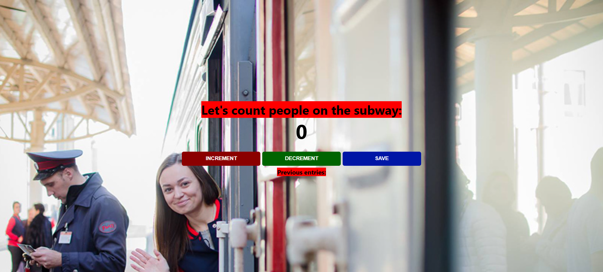

<p align="center">
  
</p>

<h1 align="center">🚇 Subway Passenger Counter</h1>

<p align="center">
  <em>A simple, interactive, and responsive web application to track and save passenger counts — crafted with pure HTML, CSS, & JavaScript.</em>
</p>

<p align="center">
  
  
  
  
</p>

<p align="center">
  <a href="https://waleedtarbosh.github.io/Subway-Passenger-Counter/">🌐 Live Demo ⚡</a>
  &nbsp;&nbsp;|&nbsp;&nbsp;
  <a href="#-core-features">✨ Features</a>
</p>

---

## 📖 Project Description

**Subway Passenger Counter** is a lightweight, interactive web application designed to help users count passengers boarding and exiting a train. Built entirely with **vanilla HTML, CSS, and JavaScript** — demonstrating fundamental DOM manipulation, event handling, and clean responsive design.

The application features a straightforward interface with increment, decrement, and save capabilities. It maintains a running log of previous entries, making it easy to track passenger flow over time. A beautiful subway-themed background and responsive mobile styling complete the experience.

> 💡 **Why this project stands out:** It demonstrates essential JavaScript concepts including state management, DOM updates, string concatenation, and event listeners, combined with a responsive, media-query-driven CSS layout.

---

## 📸 Screenshots 🖼️

<div align="center">
  <table>
    <tr>
      <th align="center">Screen</th>
      <th align="center">🖥️ Desktop View</th>
      <th align="center">📱 iPad Pro</th>
      <th align="center">📲 iPhone 14 Pro Max</th>
    </tr>
    <tr>
      <td align="center"><strong>Counter App</strong></td>
      <td align="center"></td>
      <td align="center"></td>
      <td align="center"></td>
    </tr>
  </table>
</div>

---

## 📖 Table of Contents

- [🛠️ Technologies Used](#️-technologies-used-)
- [✨ Core Features](#-core-features)
- [🗺️ Application Layout](#️-application-layout)
- [📂 Folder Structure](#-folder-structure)
- [🚀 Installation Instructions](#-installation-instructions)
- [💻 How to Run](#-how-to-run)
- [🎨 Design Decisions](#-design-decisions)
- [🚀 Future Improvements](#-future-improvements)
- [🤝 How to Contribute](#-how-to-contribute)
- [✍️ Author](#️-author)
- [📄 License](#-license)

---

## 🛠️ Technologies Used 🎨

| Technology | Purpose | Details |
|:---:|:---|:---|
|  | **Structure** | Semantic HTML5 layout and clear element hierarchy |
|  | **Styling** | Custom styling, intuitive buttons, and responsive media queries |
|  | **Logic** | DOM manipulation, state variables, and event handling |

### 🎨 Design System

```
🎨 Color Palette
├── Increment Button → Dark Red (darkred)
├── Decrement Button → Dark Green (darkgreen)
├── Save Button      → Blue (rgb(0, 22, 166))
├── Text Highlights  → Red & Black combinations
└── Background       → Full-cover Subway Image

🔤 Typography
├── Font Stack       → System UI (-apple-system, BlinkMacSystemFont, Segoe UI, Roboto...)
└── Styling          → Bold weights, centered text, prominent readable headers
```

---

## ✨ Core Features

<table>
  <tr>
    <td width="50%">

### 🎯 Application Logic
- ✅ **Increment Counter**: Adds to the passenger count when boarding.
- ✅ **Decrement Counter**: Subtracts from the passenger count when exiting (includes conditional logic to handle empty trains).
- ✅ **Save State**: Logs the current count to a historical entry list and resets the main counter.

    </td>
    <td width="50%">

### 🎨 UI & Responsive Design
- ✅ **Themed Background**: Immersive full-screen subway background image.
- ✅ **Responsive Layout**: Adjusts background scaling and layout for mobile devices (`max-width: 600px`).
- ✅ **Clear Call-to-Actions**: Distinctly colored buttons for different actions.

    </td>
  </tr>
</table>

---

## 🗺️ Application Layout

The application is organized into a clean, centered interface:

```
┌─────────────────────────────────────────────┐
│  🚇 Subway Passenger Counter               │
├─────────────────────────────────────────────┤
│  "Let's count people on the subway:"        │
│                                             │
│                 [ 0 ]                       │
│                                             │
│            [ INCREMENT ]                    │
│            [ DECREMENT ]                    │
│            [   SAVE    ]                    │
│                                             │
│  Previous entries: 5 - 12 - 3 -             │
└─────────────────────────────────────────────┘
```

---

## 📂 Folder Structure

```
Subway-Passenger-Counter/
│
├── 📄 index.html               # Main application layout and structure
├── 📄 script.js                # Core JavaScript logic for counting and saving
├── 🎨 style.css                # Application styling and responsiveness
├── 🖼️ bg-train.jpg             # Background image asset
└── 📄 README.md                # Project documentation
```

---

## 🚀 Installation Instructions

### Prerequisites
- Any modern web browser (Chrome, Firefox, Safari, Edge)
- Git (optional, for cloning)

### Steps

**1. Clone the repository:**

```bash
git clone https://github.com/waleedtarbosh/Subway-Passenger-Counter.git
```

**2. Navigate to the project directory:**

```bash
cd Subway-Passenger-Counter
```

**3. Open in your browser:**

```bash
# Simply double-click the index.html file, or drag and drop it into your browser!
```

---

## 💻 How to Run

Since this is a static web application built with Vanilla HTML, CSS, and JS, no servers or build tools are required. Just open `index.html` in your favorite web browser and start counting!

---

## 🎨 Design Decisions

| Decision | Rationale |
|:---|:---|
| **Vanilla JavaScript** | Perfect for a lightweight counting tool; avoids overhead of frameworks. |
| **System Fonts** | Ensures fast loading and native look-and-feel across all operating systems. |
| **Color-coded Buttons** | Enhances UX by visually separating the Add, Subtract, and Save actions. |
| **Console Logging** | Provides helpful developer feedback during passenger tracking and testing. |

---

## 🚀 Future Improvements

- [ ] 💾 **Local Storage** — Save the "Previous entries" across browser reloads.
- [ ] 🛑 **Negative Value Prevention** — Add stricter logic to prevent the counter from going below zero entirely on display.
- [ ] 🎨 **Animations** — Add CSS transitions when the counter number updates.
- [ ] 🕒 **Timestamps** — Attach a time to each saved entry (e.g., `12 (10:00 AM) - `).
- [ ] 🗑️ **Clear History** — Add a button to wipe the previous entries log.

---

## 🤝 How to Contribute

Contributions are always welcome! Here's how you can help:

```
1. 🍴 Fork the repository
2. 🌿 Create a feature branch        →  git checkout -b feature/AmazingFeature
3. ✏️  Make your changes              →  Edit files
4. 💾 Commit your changes            →  git commit -m "Add: AmazingFeature"
5. 📤 Push to the branch             →  git push origin feature/AmazingFeature
6. 🔃 Open a Pull Request            →  Compare & submit on GitHub
```

---

## ✍️ Author

<p align="center">
  <a href="https://github.com/waleedtarbosh">
    
  </a>
</p>

<p align="center">
  <strong>Waleed Tarbosh</strong><br/>
  Front-End Developer<br/>
  <em>Made with ❤️ and code</em>
</p>

---

## 📄 License

This project is open source and available under the [MIT License](LICENSE).

```
Copyright (c) 2024 Waleed Tarbosh
```

---

<p align="center">
  <sub>⭐ If you found this project useful, please consider giving it a star on GitHub! ⭐</sub>
  <br/><br/>
  <a href="#-subway-passenger-counter">⬆️ Back to Top</a>
</p>
